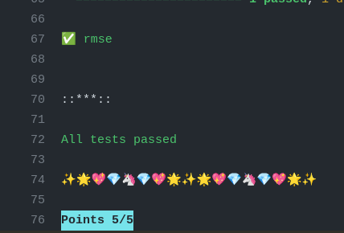

### About

- These codes are part of the Mathematical Concepts for Deep Learning (AASD 4011) course studies of the Postgraduate in Applied A.I. Solutions Development (T431) program at George Brown College.
- For more information about the program, visit the [Website](https://www.georgebrown.ca/programs/applied-ai-solutions-development-program-postgraduate-t431).
  

------------

# Assignment 1

# Ex-1: Introduction to GitHub Submission Process

## Overview
In this assignment, you will familiarize yourself with the GitHub submission process.

## Objectives
1. Get comfortable with GitHub submission process by completing a function to output your name.
2. Push the changes and successfully run autograde.

## The Assignment

The file 'get_a_point_for_writing_your_name.py' contain methods that are incomplete.
The current tests are failing because this method isn't providing the correct output. 
You are required to fix them up and ensure the test passes for a successful submission.

---

## Validating and Evaluating Your Results

### Online
1. After committing and pushing your code, check the mark on the top line (near the commit ID).
2. If some tests are failing, click on the ❌ to open up a popup, which will show details about the errors.
3. You can click the [Details]() link to see what went wrong. Pay special attention to lines with the words "Failed" or "error".

4. Near the bottom of the [Details]() page, you can see your score. Here are examples of 0/5 and 5/5:

 

5. When you achieve a perfect score, you will see a green checkmark near the commit ID.

### Locally
1. You can test your code locally by installing and running `pytest` (`pip install pytest` or `conda install pytest`).
2. Run the tests using the command `pytest` in your terminal. This will show the status of each test and any errors that occurred.

### Attachments 
- [ex1_test.py](https://github.com/ednaldogoncalves/GBC-AppliedMathDeepLearning/blob/main/assignment1/attachments/ex1_test.py)
- [get_a_point_for_writing_your_name.py](https://github.com/ednaldogoncalves/GBC-AppliedMathDeepLearning/blob/main/assignment1/attachments/get_a_point_for_writing_your_name.py)