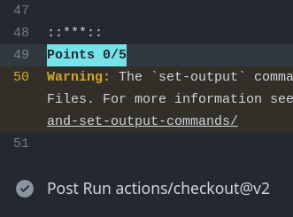

### About

- These codes are part of the Mathematical Concepts for Deep Learning (AASD 4011) course studies of the Postgraduate in Applied A.I. Solutions Development (T431) program at George Brown College.
- For more information about the program, visit the [Website](https://www.georgebrown.ca/programs/applied-ai-solutions-development-program-postgraduate-t431).
  

------------

# Assignment 1

# Ex-1: Introduction to GitHub Submission Process

## Overview
In this assignment, you will familiarize yourself with the GitHub submission process.

## Objectives
1. Get comfortable with GitHub submission process by completing a function to output your name.
2. Push the changes and successfully run autograde.

## The Assignment

The file [get_a_point_for_writing_your_name.py](https://github.com/ednaldogoncalves/GBC-AppliedMathDeepLearning/blob/main/assignment1/attachments/get_a_point_for_writing_your_name.py) contain methods that are incomplete.
The current tests are failing because this method isn't providing the correct output. 
You are required to fix them up and ensure the test passes for a successful submission.

---

### Attachments 
- [ex1_test.py](https://github.com/ednaldogoncalves/GBC-AppliedMathDeepLearning/blob/main/assignment1/attachments/ex1_test.py)
- [get_a_point_for_writing_your_name.py](https://github.com/ednaldogoncalves/GBC-AppliedMathDeepLearning/blob/main/assignment1/attachments/get_a_point_for_writing_your_name.py)

------------

# Assignment 2

# Ex-2: Computational Derivation and Matrix Multiplication

## Overview
In this exercise, you will practice computational derivation and matrix multiplication.

## Objectives
1. Calculate the derivative of a function at a given point.
2. Perform matrix multiplication with tensors.
3. Implement a simple RMSE function.

## The Assignment

### Computational Derivation (1 point)
1. Given a function $f()$, calculate the derivative of the function $f$ at point $x$ using the definition of the derivative and evaluating the slope between points $x$ and $x+h$.
2. So, $f'()$ at point $x$ is ${{f(x+h) - f(x)} \over h}$ when $h$ is _very small_.
3. You can also use the definition ${{f(x+h) - f(x-h)} \over 2h}$. For the purpose of this exercise, you can take $h$ to a small value of your choosing (e.g., $h=0.001$).

### RMSE Implementation (1 points)
1. Follow the instructions provided in the [rmse.py](https://github.com/ednaldogoncalves/GBC-AppliedMathDeepLearning/blob/main/assignment2/attachments/rmse.py) file.
2. RMSE (Root Mean Square Error) = $\sqrt{\frac{1}{n}\sum_{i=1}^{n}(y_i - \hat{y_i})^2}$, where $y_i$ are the true values, $\hat{y_i}$ are the predicted values, and $n$ is the total number of samples.

### Matrix Multiplication (3 points)
1. Follow the instructions provided in the [tensor_multiplication.py](https://github.com/ednaldogoncalves/GBC-AppliedMathDeepLearning/blob/main/assignment2/attachments/tensor_multiplication.py) file.
2. Your solution should be concise, typically a one-liner.
3. We introduce the transpose operator `W.T`, which switches the dimensions around. This is to conform with conventions of how the weight matrix is typically written in PyTorch and to ensure that when we perform matrix multiplication, the inner dimensions match.

---

### Attachments 
- [numeric_derivation.py](https://github.com/ednaldogoncalves/GBC-AppliedMathDeepLearning/blob/main/assignment2/attachments/numeric_derivation.py)
- [numeric_derivation_test.py](https://github.com/ednaldogoncalves/GBC-AppliedMathDeepLearning/blob/main/assignment2/attachments/numeric_derivation_test.py)
- [rmse.py](https://github.com/ednaldogoncalves/GBC-AppliedMathDeepLearning/blob/main/assignment2/attachments/rmse.py)
- [rmse_test.py](https://github.com/ednaldogoncalves/GBC-AppliedMathDeepLearning/blob/main/assignment2/attachments/rmse_test.py)
- [tensor_multiplication.py](https://github.com/ednaldogoncalves/GBC-AppliedMathDeepLearning/blob/main/assignment2/attachments/tensor_multiplication.py)
- [tensor_multiplication_test.py](https://github.com/ednaldogoncalves/GBC-AppliedMathDeepLearning/blob/main/assignment2/attachments/tensor_multiplication_test.py)

------------

# Assignment 3

# Ex-3: Regression in Harry Potter Universe

## Overview
In this exercise, we will use regression to predict the value of vaults in a hypothetical scenario based on the number of gold and silver coins in each vault.

## Objectives
1. Train a model using given data of vaults.
2. Use the trained model to predict the value of other vaults.

## The Assignment
We are in the Harry-Potter-verse. 
We have the data about the value of several vaults in GB Pounds.
We also know how many pieces of gold there are in each vault.
Here is a list.
you don't have to copy it, a function in the tests will generate it. 

| # Gold | # Silver | Value (GBP)  |
|-------|------|---------|
| 24.0, | 2.0, | 1422.40 |
| 24.0, | 4.0, | 1469.50 |
| 16.0, | 3.0, | 1012.70 |
| 25.0, | 6.0, | 1632.20 |
| 16.0, | 1.0, |  952.20 |
| 19.0, | 2.0, | 1117.70 |
| 14.0, | 3.0, |  906.20 |
| 22.0, | 2.0, | 1307.30 |
| 25.0, | 4.0, | 1552.80 |
| 12.0, | 1.0, |  686.70 |
| 24.0, | 7.0, | 1543.40 |
| 19.0, | 1.0, | 1086.50 |
| 23.0, | 7.0, | 1495.20 |
| 19.0, | 5.0, | 1260.70 |
| 21.0, | 3.0, | 1288.10 |
| 16.0, | 6.0, | 1111.50 |
| 24.0, | 5.0, | 1523.10 |
| 19.0, | 7.0, | 1297.40 |
| 14.0, | 4.0, | 946.40  |
| 20.0, | 3.0, | 1197.10 |

We would like to guess the value of a few other vaults, given the number of gold and silver coins known to be in them.

### Part 1. Train a model 
* Using 1d or 2d data, (i.e. using just the gold pieces counter or both coin cunter), create a model and train it. 
* The tests will pass when the loss is small enough.
* You need to change some of the code in the file [regression.py](https://github.com/ednaldogoncalves/GBC-AppliedMathDeepLearning/blob/main/assignment3/attachments/regression.py) - follow what we did in class.
* You can get a tuple with the shape of a tensor using `shape`

### Part 2. Use the model to predict some unknown values
* Once you've trained the model, these tests will predict some unseen vaults.
* Thought excercise - ungraded, how would you calculate the modeled value of a gold coin, given a trained model?

---

### Attachments 
- [regression.py](https://github.com/ednaldogoncalves/GBC-AppliedMathDeepLearning/blob/main/assignment3/attachments/regression.py)
- [regression_test.py](https://github.com/ednaldogoncalves/GBC-AppliedMathDeepLearning/blob/main/assignment3/attachments/regression_test.py)

------------

# Assignment 4

# Ex-4: Binary Classifier for MNIST

## Overview
In this exercise, you will implement a binary classifier to classify a single number from the MNIST dataset. You will be required to complete the functions provided in the Python files.

## Objectives
1. Define dense models with single and hidden layers.
2. Train a model to classify a single digit from the MNIST dataset.
3. Evaluate the performance of the trained model.

## The Assignment
You are required to complete the following functions in 'layered_model.py'. Your completed functions should pass the tests provided.
1. `define_dense_model_single_layer`: Define a dense model with a single layer.
2. `define_dense_model_with_hidden_layer`: Define a dense model with a hidden layer.
3. `fit_mnist_model_single_digit`: Train the model for a single digit classification.
4. `evaluate_mnist_model_single_digit`: Evaluate the performance of the trained model.

---
### Attachments 
- [layered_model.py](https://github.com/ednaldogoncalves/GBC-AppliedMathDeepLearning/blob/main/assignment4/attachments/layered_model.py)
- [layered_model_test.py](https://github.com/ednaldogoncalves/GBC-AppliedMathDeepLearning/blob/main/assignment4/attachments/layered_model_test.py)

------------

# Assignment 5

# Ex-5: Multiclass Classifier

## Overview
In this exercise, you will implement a multiclass classifier using the concepts learned in previous exercises.

## Objectives
1. Enhance your understanding of multiclass classification.
2. Reuse and modify solutions from previous exercises.
3. Implement and train a multiclass classifier model.
4. Evaluate the performance of the model.

## The Assignment
You can reuse your solutions for `define_dense_model_single_layer` and `define_dense_model_with_hidden_layer` from Exercise 4. However, you need to fill in the functions `fit_mnist_model` and `evaluate_mnist_model`. Try to experiment with the number of epochs and batch size if the tests do not pass initially.

---
### Attachments 
- [multiclass_model.py](https://github.com/ednaldogoncalves/GBC-AppliedMathDeepLearning/blob/main/assignment5/attachments/multiclass_model.py)
- [multiclass_model_test.py](https://github.com/ednaldogoncalves/GBC-AppliedMathDeepLearning/blob/main/assignment5/attachments/multiclass_model_test.py)

------------

# Assignment 6

# Ex-6: Trainable Layers in Neural Networks

## Overview
In this exercise, you will learn to create and modify neural network layers.

## Objectives
1. Define dense models with multiple hidden layers.
2. Set specific layers as trainable or non-trainable.

## The Assignment

### define_dense_model_with_hidden_layers
Modify your solution from the previous exercise for `define_dense_model_with_hidden_layers`. This function should accept an array of hidden layer sizes and an array of the activation functions. Keep the following points in mind when coding:

* The first layer is different because it should accept an `input_layer` parameter.
* The output layer should use the `output_function` and `output_length` parameters.

### set_layers_to_trainable
The function `set_layers_to_trainable` should take a model and an array of layer numbers. It should set the layers in the array to `trainable` and the other layers to non-trainable.

---
### Attachments 
- [trainable_layers.py](https://github.com/ednaldogoncalves/GBC-AppliedMathDeepLearning/blob/main/assignment6/attachments/trainable_layers.py)
- [trainable_layers_test.py](https://github.com/ednaldogoncalves/GBC-AppliedMathDeepLearning/blob/main/assignment6/attachments/trainable_layers_test.py)

------------
# Mid-Term Project: Image Classification Using CNN

## Overview
In this exercise, you will learn to use image dataset for classification.

## Objectives
- Build image classification CNN using python on the ImageNet datasets.
- CNNs work for the image classification task
- Using TensorFlow’s Keras library to demonstrate image classification using CNNs

## Dataset

There are various datasets that you can leverage for applying convolutional neural networks. Here are three popular datasets:

- MNIST
- CIFAR-10
- ImageNet

## Libraries

The algorithm described in Python 3.11.6 will be implemented, using the Keras library (on top of the TensorFlow libraries, which works as a backend). Allows the use of a GPU, if present, to accelerate the computation, which is recommended in the case of this type of networks, since their training is computationally heavy.

## Download the Imagenette dataset

Once you have downloaded the dataset, you will notice that it has two folders – “train” and “val”. These contain the training and validation set, respectively. Inside each folder, there are separate folders for each class.

`!wget https://s3.amazonaws.com/fast-ai-imageclas/imagenette2.tgz`

`!tar -xf imagenette2.tgz`

It was not added to GitHub due to the size of the directory.

## The Project

The file: [image_classification_cnn_imagenet_dataset.ipynb](https://github.com/ednaldogoncalves/GBC-AppliedMathDeepLearning/blob/main/mid_term_project/Image_Classification_CNN_ImageNet_Dataset.ipynb)

## The Models

The **.h5** models generated after execution were also not included in GitHub due to the size of the directory, but they can be downloaded from the links below:

- [cnn_model.h5](https://drive.google.com/file/d/1kqNxrpReP-LI75G9mq7ePZPz-4mUr_ON/view?usp=sharing)
- [fcnn_inception_model.h5](https://drive.google.com/file/d/1k4KPyySb8_tjYW8yNSozmuLzLkcpBPW9/view?usp=sharing)
- [fcnn_efficientNet_model.h5](https://drive.google.com/file/d/1kJ9F5JuRki_DV6Vdc9J0662iHs9HcvLL/view?usp=sharing)
- [fcnn_restnet_model.h5](https://drive.google.com/file/d/1kGM97e87u_f_y4PjFeND8xCTbO_Gh9fI/view?usp=sharing)
- [fcnn_vgg_model.h5](https://drive.google.com/file/d/1kaf_c6msmuIz1TbZTOZNgNZRNdFdV7uM/view?usp=sharing)

------------
## Validating and Evaluating Your Results

### Online
1. After committing and pushing your code, check the mark on the top line (near the commit ID).
2. If some tests are failing, click on the ❌ to open up a popup, which will show details about the errors.
3. You can click the [Details]() link to see what went wrong. Pay special attention to lines with the words "Failed" or "error".

4. Near the bottom of the [Details]() page, you can see your score. Here are examples of 0/5 and 5/5:

 

5. When you achieve a perfect score, you will see a green checkmark near the commit ID.

### Locally
1. You can test your code locally by installing and running `pytest` (`pip install pytest` or `conda install pytest`).
2. Run the tests using the command `pytest` in your terminal. This will show the status of each test and any errors that occurred.

Good luck!
